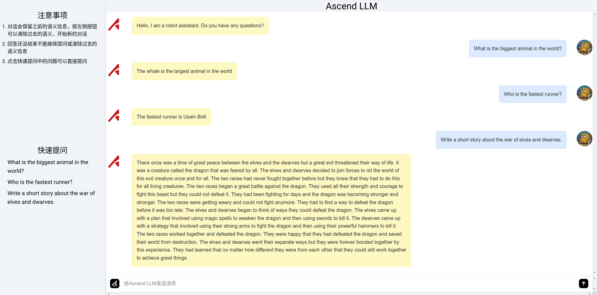

# ascend-llm

## 简介

本项目基于昇腾310芯片部署大语言模型，目前已经成功运行meta-llama/Llama-2-7b-hf和TinyLlama/TinyLlama-1.1B-Chat-v1.0。

本实践项目由南京大学计算机科学与技术系杜骋同学主导，由朱光辉老师进行指导，由昇腾CANN生态使能团队提供技术支持。

## 效果预览




## 关键技术
- 静态图方案

    在Transformer模型中，基于模型的自回归推理特性，业界普遍采用kvcache缓存的方式增加模型的推理性能.kvcache会缓存上一次推理得到的kv矩阵用于本次推理，大大减少了推理计算量。
    
    由于缓存的kv矩阵要和当前输入字符计算出的kv矩阵进行拼接，因此每次推理完整的kv矩阵长度一直在增加，致使模型shape不固定，会走动态推理流程，存在大量算子编译时间，推理性能大大下降。
    
    本方案基于原先动态图方案，将kv矩阵固定到一个最大长度，结合attention_mask屏蔽输入序列部分位置的特性实现了静态图的方案.在kvcache达到上限时通过主动清理kvcache的方式让模型可以反复推理。

- 量化方案

    大模型权重过大，在端侧设备由于内存限制通常难以运行，因此通常将大模型权重从fp16量化到int8甚至int4降低内存消耗.

    本项目采用平滑激活（SmoothQuant），动态混合精度分解（类似LLM.int8()），静态混合精度分解量化方案，通过对权重和激活值均采用int8量化，显著节省了内存并提升了推理速度.


## 运行方式

### 环境准备

1. 昇腾软硬件解决方案(驱动+固件+CANN)
   
   前往[昇腾社区](https://www.hiascend.com/document/detail/zh/CANNCommunityEdition/700alpha002/cannquickstart/quickstart/instg_000021.html)，按照说明下载安装。
   或者下载[香橙派0318镜像](https://www.hiascend.com/forum/thread-0231149828762292018-1-1.html)，烧录到sd卡，启动环境，参考[香橙派AIpro快速上手指南](https://www.hiascend.com/forum/thread-0260140249549075069-1-1.html)。 
2. 第三方依赖
   
   模型导出和推理相关文件夹下requirements.txt，使用pip 进行安装。
   
   ```shell
   pip install -r requirements.txt
   ```

本项目测试环境：香橙派AI pro，CANN 7.0/7.2，python 3.9。

### 模型量化与导出

1. 导出onnx：将transformer库中的modeling_llama替换为export_llama文件下的[modeling_llama](./export_llama/modeling_llama_4.35.py)。通过一下命令将模型导出为onnx（相对路径均为相对export_llama.py文件）
	```bash
	python export_llama.py \
		--model <model_name_or_path> \
		--output <output_onnx_file_path> \
		--act-path <act_scales_file_path>
		--quant <quant_config_file_path>
	```
	模型量化具体见[readme](./export_llama/readme.md)。对于TinyLlama-1.1B建议采用per-token的absmax量化（即w8x8.py）或者平滑激活（即smooth.py）；对于Llama-2-7b-hf，建议采用静态混合精度分解（即sd.py）或者平滑激活+静态混合精度分解(即smsd.py)。已经测试的方案为TinyLlama-1.1B per-token的absmax量化，Llama-2-7b-hf 静态混合精度分解。
3. ATC模型转换
	``` bash
	atc --framework=5 --model="xxx.onnx"  --output="xxx" --input_format=ND --input_shape="input_ids:batch,seq_len;attention_mask:batch,seq_len+kv_len;position_ids:batch,seq_len;past_key_values:n_layer,2,batch,n_head,kv_len,head_dim" --log=debug --soc_version=Ascend310B1 --precision_mode=must_keep_origin_dtype
	```
	上述的n_layer, n_head, head_dim变量由模型决定。对于Llama-2-7b，n_layer=32, n_head=32, head_dim=128；对于TinyLlama-1.1B，n_layer=22, n_head=4, head_dim=64
	
	对于batch, seq_len, kv_len, 请根据需要填入，建议设置batch=1, seq_len=1, kv_len=1024。如对于TinyLlama-1.1B
	
	```bash
	atc --framework=5 --model="./tiny-llama.onnx"  --output="tiny-llama" --input_format=ND --input_shape="input_ids:1,1;attention_mask:1,1025;position_ids:1,1;past_key_values:22,2,1,4,1024,64" --log=debug --soc_version=Ascend310B1
	```
	
	对于Llama-2-7b，ATC转换占用内存较大，建议采用其他设备转换，如采用香橙派进行模型转换可以`export MAX_COMPILE_CORE_NUMBER=1`和`export MAX_COMPILE_CORE_NUMBER=1`，并开swap分区（推理时请关闭swap，会影响性能）。

### 算子适配

 - protoc安装
	根据昇腾文档选择合适的protoc版本，protoc版本和CANN版本强相关。CANN7.0/7.2使用的protoc 1.13.0
    ```
    # 安装protoc==1.13.0， 找一空闲目录下载
    wget  https://obs-9be7.obs.cn-east-2.myhuaweicloud.com/wanzutao/tiny-llama/protobuf-all-3.13.0.tar.gz --no-check-certificate
    tar -zxvf protobuf-all-3.13.0.tar.gz
    cd protobuf-3.13.0
    apt-get update
    apt-get install autoconf automake libtool
    ./autogen.sh 
    ./configure
    make -j4
    make install
    sudo ldconfig
    protoc --version # 查看版本号
    ```

 - 算子编译部署
    ```
    # 将./custom_op/matmul_integer_plugin.cc 拷贝到指定路径
    cd tiny_llama
    export ASCEND_PATH=/usr/local/Ascend/ascend-toolkit/latest
    cp custom_op/matmul_integer_plugin.cc $ASCEND_PATH/tools/msopgen/template/custom_operator_sample/DSL/Onnx/framework/onnx_plugin/
    cd $ASCEND_PATH/tools/msopgen/template/custom_operator_sample/DSL/Onnx 
    ```
    打开build.sh，找到下面四个环境变量，解开注释并修改如下：
    ```
    export ASCEND_TENSOR_COMPILER_INCLUDE=/usr/local/Ascend/ascend-toolkit/latest/include
    export TOOLCHAIN_DIR=/usr
    export AICPU_KERNEL_TARGET=cust_aicpu_kernels
    export AICPU_SOC_VERSION=Ascend310B4
    ```
 - 编译运行
    ```
    ./build.sh 
    cd build_out/
    ./custom_opp_ubuntu_aarch64.run
    # 生成文件到customize到默认目录 $ASCEND_PATH/opp/vendors/，删除冗余文件
    cd $ASCEND_PATH/opp/vendors/customize
    rm -rf op_impl/ op_proto/
    ```

### 模型推理运行 

目前提供两种运行模式：
1. cli模式：`cd inference/ && python main.py --cli`，在终端运行，每一次输入一行，一次性返回所有的推理结果。
2. web模式：`cd inference/ && python main.py`，前端代码在[github](https://github.com/yinghuo302/ascend-llm-web)或者[gitee](https://gitee.com/yinghuo302/ascend-llm-web)，打包出dist文件夹，放在inference文件夹下即可。

代码需要修改的部分主要在与config.py，可以根据注释修改。inference.py中关于输入格式和结束语判断的部分可能也需要根据具体的模型修改。